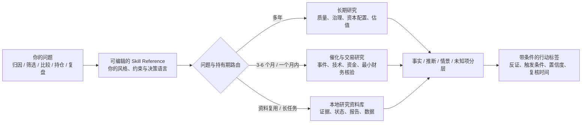
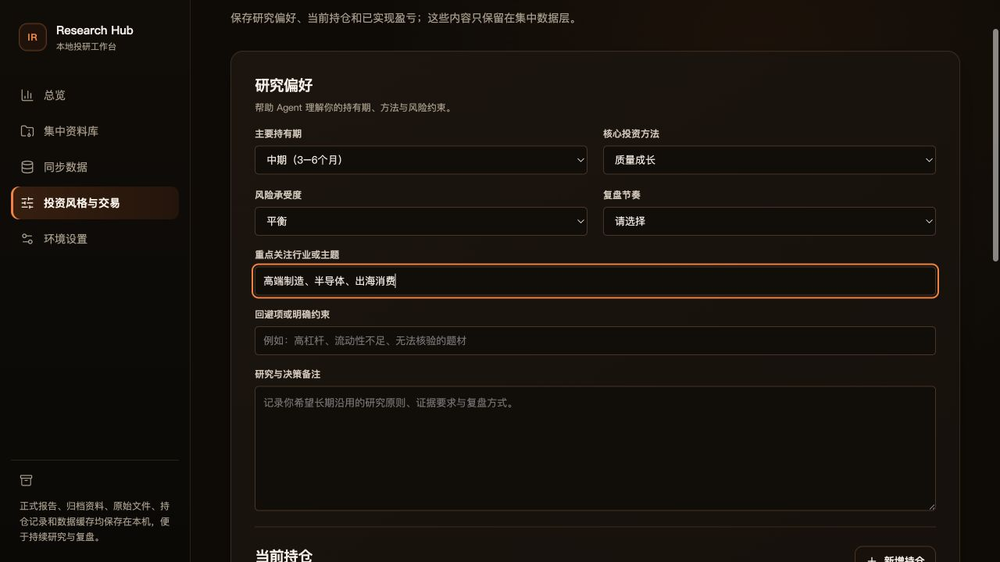

# IR Skill

> 面向 A 股与中国市场研究的 Codex Skill。先厘清问题、持有期和证据边界，再形成可追溯、可证伪、带条件的研究判断。

<p align="center">
  
</p>

<p align="center">
  <strong>可定制投资风格</strong> &nbsp;|&nbsp; <strong>证据优先</strong> &nbsp;|&nbsp; <strong>本地资料库 UI</strong> &nbsp;|&nbsp; <strong>长期可复用</strong>
</p>

多数“AI 投研”工具的问题，不是不会算指标，而是把完全不同的问题塞进同一份筛选表、评分模型或报告模板：短线交易被迫做完整基本面，长期研究又被新闻热度带偏；二级数据和抓取内容被误当成财务事实；历史笔记要么完全丢失，要么不加甄别地污染当下判断。

IR Skill 让 Codex 成为研究伙伴，而不是自动荐股器、固定状态机或黑箱打分器。它把稳定、可复用的研究纪律保留在底层，把策略、偏好和约束留给你来定义。

> **最重要的一点：`SKILL.md` / Skill Reference 可以直接改成你的投资风格。**
> 无论你采用质量成长、价值与安全边际、周期景气、事件驱动、技术交易，还是自己的混合方法，都可以调整路由、研究重点、行动标签、触发条件与复盘节奏，再在 UI 中维护实时偏好与交易上下文。

> 本项目仅用于研究辅助，不构成投资建议、收益承诺或自动交易指令。

## 一图看懂



## 为什么它更适合长期复用

一次性 Prompt、固定报告模板或单一策略的 Skill，通常只能在某一个问题、某一种持有期或某一套偏好下工作。IR Skill 将“普适的研究底座”与“可变的投资方法”分离，因此复用范围显著高于只能服务固定流程的投研 Skill。

| 层级 | IR Skill 的设计 | 带来的复用价值 |
| --- | --- | --- |
| 研究底座 | 事实、推断、情景与未知项分层；关键数据保留来源与时点 | 同一份研究可以复核、更新，也能被不同风格的投资者重新解读 |
| 意图路由 | 先区分归因、筛选、比较、持仓、复盘和研究计划，再选择最小必要路径 | 不因问题变化就推倒重来，也不为了“完整模板”制造无用工作 |
| 持有期 | 长期研究与中短期催化/交易研究使用不同证据包和门槛 | 好公司、好价格、好交易不是一个总分，避免相互覆盖 |
| 策略参考层 | `SKILL.md` 是纯 Markdown，可修改为自己的研究原则与行动语言 | 质量、价值、周期、事件、技术或混合方法都能复用同一工具与数据层 |
| 本地上下文层 | Research Hub 将偏好、持仓、交易、资料、报告与 SQLite 数据留在本机 | 偏好可随时更新；授权后才参与后续研究，不污染项目默认方法论 |
| 机械化工具层 | Python 脚本只做采集、缓存、计算、校验、归档与恢复 | Agent 专注判断和证据取舍，脚本输出不会被伪装成投资结论 |

## 把它改成你的投资风格

IR Skill 不要求你接受某一种投资哲学。它提供的是一个可靠的研究操作系统：证据边界、时间边界、反证要求、持久化边界和工具职责保持稳定；你的方法论、风险约束与决策表达可以自行迭代。

### 两层定制，各司其职

| 你要调整什么 | 应该修改的位置 | 适合的内容 |
| --- | --- | --- |
| 长期默认方法论 | [`SKILL.md`](SKILL.md) | 研究优先级、核心因子、行动标签、反证标准、风险/流动性约束、复盘规则 |
| 当前个人偏好和交易背景 | 本地 UI 的“投资风格与交易”页 | 当前持有期、方法、风险承受度、关注主题、回避项、持仓与已实现盈亏 |

建议先复制或改写 `SKILL.md` 中的以下部分，让它成为自己的 Skill Reference：

1. **核心护栏**：例如把“安全边际阈值”“单一主题暴露”“不碰高杠杆”“必须有现金流验证”写成你真实执行的规则。
2. **Reference 路由**：明确你在价值、成长、周期、事件和技术信号之间如何决定研究重点。
3. **决策纪律**：保留或改写 `优先行动`、`等待价格`、`等待证据`、`继续持有`、`降低暴露` 等标签，使它们符合你的语言体系。
4. **输出与复盘**：定义你需要的仓位前提、撤销条件、再评估频率和证据标准。

下面是一段可放进 Skill Reference 的示例。它是方法论的起点，不是强制模板：

```markdown
## 我的投资规范

- 主要持有期：3-12 个月，以业绩趋势与催化兑现为主。
- 优先研究：现金流改善、盈利预测上修、景气反转、估值仍有安全垫的公司。
- 回避：无法核验的题材、高杠杆、流动性不足、只依赖单一消息源的判断。
- 行动前提：明确催化剂、最强反证、失效条件和下一次复核时间。
- 加分不是结论：技术强势只用于优化入场，不能替代对财务事实的核验。
```

不要删除“原始披露优先”“事实与推断分层”“未经授权不读取个人历史资料”这些证据与隐私护栏。它们正是策略可以长期演化而不失真的基础。

## 本地研究资料库 UI

Research Hub 是项目自带的本地投研工作台，仅监听 `127.0.0.1`。它不是另一个黑箱选股器，而是把你已经授权的研究上下文、资料和数据放在一个可检查的界面中。



| 页面 | 你可以做什么 | 数据位置 |
| --- | --- | --- |
| 总览 | 查看资料、报告、同步数据与覆盖范围 | 本地集中数据层的只读摘要 |
| 集中资料库 | 按个股、行业、市场、宏观与资料类型浏览正式报告、可复用资料与原始文件 | `report/` 与 `data/research-library/files/` |
| 同步数据 | 用中文表名查看 SQLite 数据表、时点、记录数和样本 | `data/research-library/database/` |
| 投资风格与交易 | 更新持有期、方法、风险、关注主题、约束、持仓和交易/盈亏记录 | `data/research-library/settings/investor-profile.json` |
| 环境设置 | 以掩码保存 TuShare Token 到项目本地 `.env` | `.env` |

个人资料、持仓和盈亏只保存在本机。Skill 不会在未得到明确授权时自动读取、继承或写入它们；即使授权复用，也应标明资料时点并重新核验关键事实。

### 启动 UI

```bash
cd web
npm install
npm run start
```

浏览器会打开 `http://127.0.0.1:8765/`。如果只希望自行启动服务，可运行：

```bash
npm run build
python3 ../scripts/research_hub_server.py --host 127.0.0.1 --port 8765
```

## 研究能力与模块

| 场景 | 主路径 | 研究重点 |
| --- | --- | --- |
| 多年持有、商业质量、治理、资本配置、长期估值 | [`references/long-term.md`](references/long-term.md) | 商业质量、财务质量、竞争优势、资本配置、治理、估值隐含预期与反方证据 |
| 3-6 个月催化、一个月内交易、事件/宏观、技术面、动量、因子筛选、价格异动 | [`references/catalyst-trading.md`](references/catalyst-trading.md) | 催化剂、价格/成交/流动性、相对强弱、风险收益与最小财务核验门槛 |
| 网页、PDF、行情、TuShare 或本地结构化数据 | [`references/evidence-data.md`](references/evidence-data.md) | 来源层级、数据时点、口径、缓存、权限与证据边界 |
| 保存、复用、历史复盘、长链路研究与上下文恢复 | [`references/persistence.md`](references/persistence.md) | 任务状态、原始资料、归档计划、正式报告与 LLM Wiki 边界 |
| 独立交叉质询或深度研究 | [`references/deep-review.md`](references/deep-review.md) | 反方论点、证据缺口、结论压力测试 |

Skill 会先选择一个主路径，只在必要时读取额外 Reference；不会为了预设的“完整性”一次性加载所有文件。

## 一个完整研究循环

```text
明确问题和约束
        ↓
选择主研究路径与最小数据包
        ↓
核验来源、as_of、报告期与口径
        ↓
形成核心假设 + 最强反证 + 未知项
        ↓
比较预期收益、下行、验证成本和机会成本
        ↓
给出行动标签、触发条件、置信度和复核时间
```

对候选比较或“当前是否行动”类问题，输出必须包含一个主行动标签：`优先行动`、`等待价格`、`等待证据`、`继续持有`、`降低暴露`、`退出或回避` 或 `选择现金`。

这不是机械推荐。行动标签必须说明最强反证、失效/触发条件、置信度与下一次复核时间；当关键事实缺失且不同事实会直接反转结论时，才使用 `等待证据`。

## 快速开始

### 1. 在 Codex 中使用

将此仓库放入 Codex 可发现的 Skill 目录，或按你的本地 Skill 管理方式安装。随后可直接提出真实研究问题，例如：

```text
比较两家 A 股公司，持有期 6 个月。请先列出真正影响排序的证据缺口，
再给出目前的行动标签、最强反证和下一次复核时间。
```

也可以让 Skill 建立候选池、解释异常波动、规划研究、复盘持仓或评估卖出条件。它会优先理解问题，而不是先套一份报告。

### 2. 可选：使用 TuShare 数据工具

```bash
python3 -m pip install pandas tushare
export TUSHARE_TOKEN="your-token"

python3 scripts/tushare_mode_data.py plan medium \
  --symbol 000001.SZ --benchmark 000300.SH --end-date 20260714

python3 scripts/tushare_mode_data.py fetch short \
  --symbol 000001.SZ --benchmark 000300.SH \
  --start-date 20260601 --end-date 20260714 --dry-run
```

`--benchmark` 默认是沪深 300，也可以改为更贴近问题的宽基或行业指数。成功采集的结构化数据默认写入 SQLite；脚本负责下载、缓存、查询和基础计算，不能替代对原始披露的核验。

数据表、字段和基准说明见 [`docs/data-layer-overview.md`](docs/data-layer-overview.md)。更一般的 TuShare 请求通过 `scripts/tushare_gateway.py` 显式传入 endpoint 与 JSON 参数。

### 3. 可选：管理可恢复的长研究任务

```bash
python3 scripts/research_task_state.py init \
  --task macro-inflation --title "通胀事件与行业映射"

# Agent 自由组织研究正文和证据，不强制统一台账模板
python3 scripts/research_task_state.py checkpoint --task macro-inflation
python3 scripts/research_task_state.py list --status active --status blocked

# 完成 archive-plan.json 后，归档原始资料并完成任务
python3 scripts/research_task_state.py complete --task macro-inflation
```

正式研究报告写入 `report/<domain>/<subject>/`；原始资料、临时状态、归档与本地 SQLite 数据放在 `data/research-library/`。只有用户要求保存、复用、沉淀或复盘时，Skill 才启用这层能力。

## 仓库结构

```text
.
├── SKILL.md                   # 可编辑的 Skill Reference、路由与安全边界
├── references/                # 长期、催化/交易、证据、持久化与深度审阅模块
├── scripts/                   # 数据、缓存、归档、任务状态与本地服务
├── web/                       # React/Vite Research Hub UI
├── tests/                     # 资料采集与资料库逻辑测试
├── docs/                      # 数据层说明
├── assets/                    # Logo 与 README 文档素材
├── report/                    # 本地正式报告目录，默认不提交
└── data/research-library/     # 本地集中数据层，默认不提交
```

## 验证

```bash
python3 -m unittest discover -s tests -v
cd web && npm run build
```

## 数据、隐私与边界

- 不要将 `TUSHARE_TOKEN`、`WEBCLAW_API_KEY`、Cookie、代理凭据或其他秘密写入代码、文档、日志或 Wiki。
- `.env`、`data/`、`report/`、`reports/`、`output/`、`tmp/`、`.obsidian/` 与本地 Wiki 都默认不提交。
- 公司财务、治理和重大事项以公司、交易所、巨潮或监管机构的原始披露为最终事实源。TuShare、新闻、网页抽取和脚本输出只作市场观察或核验线索。
- 资料库、持仓、交易和偏好都需要用户明确授权才会被读取或写入；历史资料不能替代对当前事实和时效的复核。
- 对任何可能影响结论的数据，保留来源、时间点、冲突和不确定性，不制造虚假的精确感。

## 免责声明

IR Skill 提供研究方法、证据组织与数据工具，不提供持牌投资顾问服务。市场有风险，使用者应独立判断并自行承担决策责任。
