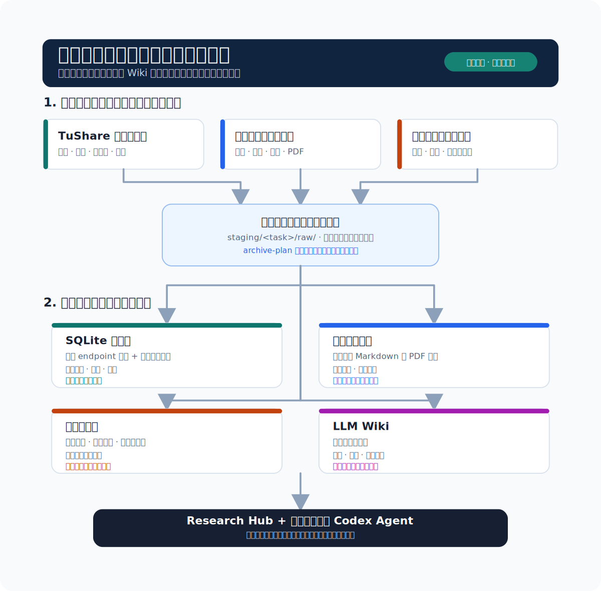

# IR Skill

> 让每一次采集、每一份报告和每一个研究结论，都成为下一次研究能直接调用的本地资产。

<p align="center">
  
</p>

<p align="center">
  <strong>TuShare 与市场数据</strong> &nbsp;|&nbsp; <strong>正式报告归档</strong> &nbsp;|&nbsp; <strong>可维护 Wiki</strong> &nbsp;|&nbsp; <strong>本地 Research Hub UI</strong>
</p>

IR Skill 是面向 A 股与中国市场研究的 Codex Skill，也是一个本地优先的研究数据复用系统。它不把一次次下载、PDF、网页、数据表和研究结论留在临时目录里；而是将它们按用途沉淀为可查询、可复核、可继续加工的资产。

> 本项目仅用于研究辅助，不构成投资建议、收益承诺或自动交易指令。

<p align="center">
  
</p>

## 日常研究的痛点，不是没有数据，而是数据不能再用

| 日常场景 | 常见结果 | IR Skill 的处理方式 |
| --- | --- | --- |
| 今天从 TuShare 拉了日线、估值、资金流，几天后又要同样的数据 | CSV、JSON 或终端输出散落在多个目录，无法知道数据时点与修订情况 | 每次成功获取都先进入本地 SQLite；任意 endpoint 保留追加式研究缓存，常用数据额外写入规范化表 |
| 收集了公告、财报、PDF 和网页，但研究结束后找不到可靠版本 | 原件、OCR、临时 HTML 与结论混在一起，下一位 Agent 无法判断什么值得复用 | 每个任务先进入 `staging/<task>/raw/`；归档计划必须覆盖每个原始文件，保留、合并或丢弃都有明确结果 |
| 完成了一份研究报告，却无法与来源、后续更新和同主题资料连接 | 报告在聊天记录或临时导出里，无法形成稳定的研究资产 | 正式交付物只写入 `report/<domain>/<YYYY-MM-DD>/`；资料库保存可复用的事实型 Markdown 与需保留的 PDF 原件 |
| 想维护长期假设与行业知识，但 Wiki 很快变成无来源的旧观点 | 旧结论被当作最新事实，链接失效后无人发现 | Wiki 仅在明确授权时构建；每页要求来源、领域与链接结构，`wiki_index.py` 可检查断链、缺失 frontmatter 和来源 |
| 已经完成归档的任务又被追加资料或审阅页 | 历史任务被重新污染，归档与复盘没有稳定边界 | 已完成或已放弃的任务拒绝继续写入；所有 `raw/` 原件处理完毕前不能标记为完成 |

这也是 IR Skill 的核心复用价值：**采集不是终点，能够在正确的位置、携带正确的时点和来源再次被调用，才是数据层的价值。**

## 四层资产，各自承担不同的复用任务

把所有内容都塞进一个文件夹或一个 Wiki，最终一定会失控。IR Skill 将不同性质的内容分开存放，并用最少的规则让它们重新连通。

| 资产层 | 保存什么 | 为什么这样保存 | 主要复用者 |
| --- | --- | --- | --- |
| **SQLite 数据层** | TuShare 任意 endpoint 的原始行、行情、交易日历、估值、资金流、财务指标、行业与指数数据 | 任意响应保留在追加式研究缓存；已知核心数据同步到规范化表，保留数据来源、抓取时间、修订与当前版本 | 数据脚本、Research Hub 的“同步数据”页、后续研究任务 |
| **可复用资料库** | 经 Agent 审阅的事实型 Markdown、公告/财报等 PDF 原件、目录索引 | 文字资料可以合并、补充和按主题读取；表格复杂或仍待核验的原件保持原始格式 | Codex Agent、资料库 UI、同公司/行业/宏观主题的后续研究 |
| **正式报告层** | 研究报告、筛选报告、决策备忘录 | 报告是面向用户的交付物，不与抓取缓存或临时材料混放 | 用户、Research Hub、复盘与对比研究 |
| **LLM Wiki** | 经明确授权后沉淀的跨轮假设、主题关系与待验证事项 | 不自动吸收所有历史材料；每页保留来源、领域和链接，避免旧观点变成隐性记忆 | 需要长期跟踪、复盘或交接的研究任务 |

所有资产默认留在本机：`data/`、`report/`、`.env` 和本地 Wiki 都不会被提交到 Git。公开仓库只保存 Skill、工具、测试和文档结构。

## 数据沉淀之后，如何用于不同投资分析

IR Skill 不是只负责保存资料的工具。数据层负责让每次研究都能复用，子 Skill 与 Reference 则按问题选择分析路径，并把数据、披露和研究材料转化为具体的研究判断。

| 分析路径 | 适用问题 | 核心分析方式 |
| --- | --- | --- |
| **长期与基本面** | 多年持有、公司质量、长期估值 | 从商业模式与需求、竞争优势、增长再投资，延伸到利润/现金质量、治理、资本配置和价格隐含预期；关注哪些变量会破坏长期逻辑。 |
| **中期催化** | 约 3-6 个月的盈利、订单、供需、政策、产品或估值催化 | 围绕催化兑现窗口、预期差，以及宏观/行业到个股的可证伪传导链，核验财务兑现、估值、资金和供给因素；关键财务事实以原始披露为准。 |
| **短期事件与交易** | 一个月内交易、宏观/行业事件、技术面、动量、因子与入场节奏 | 先以技术、动量、价格位置、成交、波动和流动性筛选候选与确认执行；宏观和行业传导只用于解释技术候选、核验业务暴露与交易可行性，不能替代技术初筛。 |
| **候选比较与行动决策** | 当前该研究谁、持有还是回避、是否等待 | 比较预期收益、下行风险、验证成本和机会成本，给出 `优先行动`、`等待价格`、`等待证据`、`继续持有`、`降低暴露`、`退出或回避` 或 `选择现金`。每个行动判断都要写明主要反证、触发/撤销条件、置信度与复核时间。 |
| **深度研究与独立质询** | 用户明确要求独立审阅或交叉质询 | 在同一时间边界下，从商业/财务/估值、竞争与替代解释、治理与尾部风险三个方向攻击核心假设，只把可能改变估值、排序或行动标签的冲突带回决策。 |

对 3-6 个月的个股推荐或候选排序，价格、估值、技术和资金数据只能产生候选，不能单独支持 `优先行动`。在行动前，Skill 会以最新年报和最新定期报告或业绩预告的原始披露，核验收入、利润率、经营现金流、营运资本及行业相关的负债或资本开支；缺失的事实足以改变排序时，结论应为 `等待证据`。

对应的子 Skill 分别为 [`skills/ir-long-term-trading/SKILL.md`](skills/ir-long-term-trading/SKILL.md)、[`skills/ir-medium-term-catalyst/SKILL.md`](skills/ir-medium-term-catalyst/SKILL.md)、[`skills/ir-short-term-trading/SKILL.md`](skills/ir-short-term-trading/SKILL.md) 和 [`skills/ir-deep-review/SKILL.md`](skills/ir-deep-review/SKILL.md)。每个子 Skill 的方法正文都直接写在自身的 `SKILL.md` 中；结构化数据进入论证，但不替代公司、交易所、巨潮或监管机构的原始披露。

## 从 TuShare 获取，到可重复使用的本地数据层

TuShare 在 IR Skill 中不是一次性“下载工具”。成功请求会经过统一存储路径：

1. **按研究模式规划数据包**：`long`、`medium`、`short` 根据任务需要取个股、基准、交易日历与市场状态；可显式指定更贴近问题的指数。
2. **显式调用任意 endpoint**：未被模式数据包覆盖的 TuShare 请求通过网关传入 endpoint 与参数，避免隐藏的请求逻辑。
3. **追加式保留每一行响应**：任意 endpoint 都进入研究观察缓存，保留业务键、数据日期、可得时间、获取时间、来源、版本和是否为当前记录。
4. **规范化常用数据**：日线、估值、财务指标、股票基础信息、交易日历、指数、行业成分与权重，以及板块字典/日线/资金流/成分、涨停事件、筹码、因子、机构调研和公司行为，会额外写入可查询的 SQLite 表；完整原始行仍保留在研究观察缓存中。
5. **在 UI 里检查，而不是裸露 SQL**：Research Hub 显示中文表名、记录数、数据时点、最近同步时间和样本预览。

```bash
python3 -m pip install pandas
export TUSHARE_TOKEN="your-token"

# 先查看一个中期研究所需的数据包
python3 scripts/tushare_mode_data.py plan medium \
  --symbol 000001.SZ --benchmark 000300.SH --end-date 20260714

# 再按明确日期范围获取；dry-run 可先检查请求范围
python3 scripts/tushare_mode_data.py fetch short \
  --symbol 000001.SZ --benchmark 000300.SH \
  --start-date 20260601 --end-date 20260714 --dry-run

# 短期研究直接读取本地日线生成的技术快照，不发起网络请求
python3 scripts/tushare_mode_data.py indicators \
  --symbol 000001.SZ --end-date 20260714

# 同花顺为默认市场板块口径；先查本地表现，无覆盖时再 plan/fetch
python3 scripts/tushare_sector_data.py performance \
  --provider ths --sector-type I --as-of 20260714 --sort-by return_5d
python3 scripts/tushare_sector_data.py plan --provider ths --as-of 20260714
python3 scripts/tushare_sector_data.py fetch \
  --provider ths --start-date 20260601 --as-of 20260714 \
  --datasets master daily flow
```

项目内置 HTTP 传输层直接使用 `TUSHARE_TOKEN`，不依赖 `tushare` Python 包；板块日度与资金流快照默认复用本地 SQLite 覆盖，传入 `--refresh` 才会强制重新请求。

`indicators` 的 `technical_snapshot` 会把末值与近期变化整理成趋势、动量、风险/位置和成交参与四组证据，并新增 `historical_price_structure`：它说明 SQLite 的实际覆盖区间，并按全可用历史、1 年、3 年给出前复权历史高低点、距高点、最大回撤、年化趋势、拟合度和价格路径标签。后续短期研究必须先检查覆盖区间，不能把缓存起点误作上市以来历史；日内高低价尚未同步时输出会明确回退至收盘价。它不产生综合分数或自动买卖信号。结构化数据不会被伪装成研究结论。它们是可带时点和口径继续分析的基础材料；公司财务、治理与重大事项仍应回到公司、交易所、巨潮或监管机构的原始披露核验。

安装 Skill 不会初始化用户数据。首次执行带缓存的模式 `fetch` 会在 `IR_SKILL_PROJECT_DIR` 指定的项目目录（未指定时为当前工作目录）下创建研究目录和 SQLite；只执行 `plan`、`--dry-run` 或 `--no-cache` 不会写入数据库。需要预先检查路径和依赖时使用 `python3 scripts/ir_project.py init --project-dir <项目目录>` 或 `status`。

## 报告、资料与原件如何归档

### 1. 研究任务先有暂存区，不直接污染资料库

每个需要跨步骤恢复的任务都有独立的 `staging/<task-name>/`。外部 HTML、PDF、Excel 或其他原件先进入 `raw/`；Agent 在这里阅读、比较和形成归档决定，而不是把所有文件自动转换为格式杂乱的 Markdown。

```bash
python3 scripts/research_task_state.py init \
  --task company-filing --title "公司公告核验"

python3 scripts/research_collect.py collect \
  --task company-filing \
  --url "https://example.com/announcement.pdf" \
  --expected-type pdf
```

采集器会验证 URL、响应体大小、Content-Type 与 PDF 文件头。安全校验页、错误页和无效 PDF 只记录失败原因，不会被伪装成研究原件保存。

### 2. 归档计划决定每一份 `raw/` 的去向

完成任务前，`archive-plan.json` 必须覆盖 `raw/` 中的所有文件。每个来源只有三种明确的归宿：

- **合并为可复用文字资料**：按 `files/<domain>/<subject>/<category>/` 保存，适合事实型、可阅读的研究材料。
- **保留原始附件**：PDF、复杂表格、OCR 待补或尚未核验的原件保留在资料库，不强制转换成不可靠的 Markdown 表格。
- **明确丢弃**：无实质内容、错误页、重复件或日常市场查询临时文件写明原因后删除。

日线、交易日历、每日估值、资金流与流动性等结构化市场查询不进入资料库 Markdown，它们应继续留在 SQLite。这条分工避免把数据库缓存伪装成“研究档案”。

```bash
# Agent 完成 archive-plan.json 后，归档原件并完成任务
python3 scripts/research_task_state.py complete --task company-filing
```

已完成或已放弃的任务不能继续接收原始资料或新审阅页；这让历史报告和资料库具备稳定的复盘边界。

### 3. 正式报告是独立的交付层

面向用户的研究报告、候选筛选报告和决策备忘录只写入：

```text
report/<domain>/<YYYY-MM-DD>/<YYYY-MM-DD>-<完整主题>-<报告类型>.md
```

日期目录和文件名前缀均使用写入当天（香港时区），格式为 `YYYY-MM-DD`；报告 frontmatter 的 `as_of` 仍只表示市场与证据时点。报告不与 SQLite 缓存、任务原件或可复用资料混放。Research Hub 从这个目录直接读取正式交付物，资料库则保存可长期复用的来源和事实材料。

## Wiki：把长期研究做成可维护的知识网络

Wiki 不是自动开启的聊天记忆。只有当用户明确要求保存、复用、建立、更新、沉淀或复盘研究时，IR Skill 才会使用它。

当某份资料被授权进入 Wiki 队列时，系统会保留原始副本和摘要来源，再由 Agent 审阅后写入主题页面。Wiki 校验会检查：

- 每个主题页是否有来源 frontmatter；
- 页面领域是否与目录一致；
- Markdown 与 Wiki 链接是否仍然有效；
- 结构文件是否完整。

这使 Wiki 适合维护“持续跟踪什么、哪些假设待验证、哪些证据改变过判断”，而不是把所有历史文本无差别塞入上下文。历史资料只能作为线索，关键事实仍需按当前时点复核。

## Research Hub：把本地资产变成可检查的界面

Research Hub 只监听 `127.0.0.1`，不将研究资料、持仓、交易记录或 Token 上传到远程。它把不同资产层集中在一个本地工作台中：


| 页面 | 日常用途 |
| --- | --- |
| 总览 | 查看资料库、正式报告、同步数据和覆盖范围的摘要 |
| 集中资料库 | 按个股、行业、市场、宏观和资料类型浏览已归档材料与原件 |
| 同步数据 | 检查 SQLite 表、记录数、数据时点、最近同步时间与样本 |
| 投资风格与交易 | 保存当前持有期、方法、风险、关注主题、约束、持仓和交易记录 |
| 环境设置 | 以掩码编辑项目本地 `.env` 中的 TuShare Token |

在 macOS 上，直接双击项目根目录的 `Research Hub.command` 即可启动并打开界面。Terminal 窗口会保持服务运行，关闭窗口或按 `Control+C` 即会停止服务。快捷方式会直接使用已构建的页面；只有页面构建文件缺失时才自动安装前端依赖并构建。服务仅在本机 `127.0.0.1:8765` 上运行。

```bash
cd web
npm ci
npm run start
```

默认地址为 `http://127.0.0.1:8765/`。如需手动启动服务：

```bash
npm run build
python3 ../scripts/research_hub_server.py --host 127.0.0.1 --port 8765
```

## 开发与验证

项目固定使用 Python 3.11+。本地开发建议在虚拟环境中安装锁定的运行依赖；前端始终用 `npm ci` 按 lockfile 安装，避免 `latest` 依赖带来不可预期的升级。

```bash
python3.11 -m venv .venv
source .venv/bin/activate
python -m pip install --upgrade pip
python -m pip install -r requirements.txt

python scripts/validate_skills.py
python -m unittest discover -s tests -v

cd web
npm ci
npm run build
python ../scripts/research_hub_server.py --host 127.0.0.1 --port 8765
```

GitHub Actions 会在干净的 Python 3.11 / Node 22 环境中执行相同的 Skill 校验、Python 测试和前端生产构建。SQLite、`.env`、报告、Wiki 与研究原件仍只保存在本地项目目录，不会上传到 CI。

## 可编辑的研究模块：把系统换成你的投资风格

数据层、归档规则和 Wiki 校验可以长期复用，但你的投资方法不应被写死。四个子 Skill 与共享研究纪律都是纯 Markdown，可以直接修改为自己的研究框架。

| 需要定制的内容 | 建议修改的位置 |
| --- | --- |
| 核心因子、风险/流动性约束、证据门槛 | `skills/shared/research-discipline.md` 的“核心要求” |
| 长期、周期、催化、事件或技术信号的优先级 | 对应持有期子 Skill 的 `SKILL.md` |
| 行动标签、目标价格、撤销条件与复盘节奏 | `skills/shared/research-discipline.md` 的“决策纪律” |
| 当前关注主题、持仓和交易上下文 | Research Hub 的“投资风格与交易”页 |

Agent 也可以在用户明确陈述当前持仓时更新同一份项目本地资料，并在持仓研究、加减仓、止损或交易策略任务开始前读取它：

```bash
python3 scripts/portfolio_context.py upsert --project-dir . --symbol 600519.SH --quantity 100 --average-cost 1500 --as-of 2026-07-19
python3 scripts/portfolio_context.py show --project-dir . --symbol 600519.SH
```

计划买卖和条件单不会被记录成当前持仓；清仓使用 `remove`。持仓价格如果没有明确时点，只作为用户提供的历史上下文，研究当前盈亏时仍需获取截至研究 `as_of` 的行情。

Agent 明确推荐并认为值得继续研究的股票会进入独立的研究跟踪池。跟踪池保存原研究路径、行动标签、核心逻辑、跟踪与失效条件、复核日期，以及正式报告的项目相对路径；详细证据仍留在报告中：

```bash
python3 scripts/research_watchlist.py upsert --project-dir . --symbol 00700.HK --name 腾讯控股 --research-path medium-term --action-label 等待价格 --thesis "等待盈利兑现与价格条件形成更好的风险收益" --next-review-on 2026-08-19
python3 scripts/research_watchlist.py show --project-dir . --symbol 00700.HK
```

用户以后明确要求继续跟踪、复盘、复用历史研究，或点名已跟踪股票并要求沿原路径研究时，Agent 才会读取该股票保存的研究路径和关联报告，再按当前 `as_of` 重新核验，而不会把旧推荐直接当作当前结论。用户只要求全市场筛选、寻找新机会或重新选股时，Agent 不读取跟踪池，也不让已有记录影响候选范围或排序；跟踪股票只有在本轮统一筛选标准下独立胜出时才会再次入选。暂停跟踪使用 `paused`，保留历史则使用 `archived`；只有用户明确要求永久删除时才使用 `remove`。

例如，你可以添加下面这段个人规范：

```markdown
## 我的投资规范

- 主要持有期：3-12 个月，以业绩趋势与催化兑现为主。
- 优先研究：现金流改善、盈利预测上修、景气反转、估值仍有安全垫的公司。
- 回避：无法核验的题材、高杠杆、流动性不足、只依赖单一消息源的判断。
- 行动前提：明确催化剂、最强反证、失效条件和下一次复核时间。
```

建议保留原始披露优先、来源与时点记录、未经授权不读取个人资料等底层护栏。它们让投资风格可以不断调整，而不会破坏已经积累的数据资产。

## 研究模块

| 任务 | 读取的主模块 |
| --- | --- |
| 多年持有、商业质量、治理、资本配置、长期估值 | [`skills/ir-long-term-trading/SKILL.md`](skills/ir-long-term-trading/SKILL.md) |
| 约 3-6 个月的盈利、订单、供需、政策、产品或估值催化 | [`skills/ir-medium-term-catalyst/SKILL.md`](skills/ir-medium-term-catalyst/SKILL.md) |
| 一个月内交易、事件/宏观、技术面、动量、因子筛选、入场节奏或价格异动 | [`skills/ir-short-term-trading/SKILL.md`](skills/ir-short-term-trading/SKILL.md) |
| 公司、交易所、监管、政府或行业机构的网页、PDF、原始披露与政策资料 | [`skills/shared/external-evidence-sources.md`](skills/shared/external-evidence-sources.md) |
| TuShare、项目 SQLite 或结构化财务、宏观、行情和跨资产数据 | [`references/tushare-data.md`](references/tushare-data.md) |
| 保存、复用、历史复盘、长链路研究与上下文恢复 | [`references/persistence.md`](references/persistence.md) |
| 独立交叉质询或深度研究 | [`skills/ir-deep-review/SKILL.md`](skills/ir-deep-review/SKILL.md) |

Skill 会按当前任务只读取必要模块，而不是把所有规则一次性加载进上下文。

## 仓库结构

```text
.
├── skills/                    # 长期、中期、短期、深研子 Skill 与共享研究纪律
├── references/                # 共享 TuShare 数据与持久化/归档规则
├── scripts/                   # TuShare、SQLite、采集、归档、Wiki、任务状态与本地服务
├── web/                       # React/Vite Research Hub UI
├── tests/                     # 资料采集与资料库逻辑测试
├── assets/                    # Logo、README SVG 与 UI 截图
├── report/                    # 本地正式报告目录，默认不提交
└── data/research-library/     # 本地 SQLite、资料库与任务暂存，默认不提交
```

## 验证

```bash
python3 -m unittest discover -s tests -v
cd web && npm run build
```

## 隐私与边界

- 不要将 `TUSHARE_TOKEN`、`WEBCLAW_API_KEY`、Cookie、代理凭据或其他秘密写入代码、文档、日志或 Wiki。
- `.env`、`data/`、`report/`、`reports/`、`output/`、`tmp/`、`.obsidian/` 与本地 Wiki 都默认不提交。
- 公司财务、治理和重大事项以公司、交易所、巨潮或监管机构的原始披露为最终事实源。TuShare、新闻、网页抽取和脚本输出只作市场观察或核验线索。
- 资料库、持仓、交易和偏好都需要用户明确授权才会被读取或写入；历史资料不能替代对当前事实和时效的复核。

## 免责声明

IR Skill 提供研究方法、数据存储与复用工具，不提供持牌投资顾问服务。市场有风险，使用者应独立判断并自行承担决策责任。
