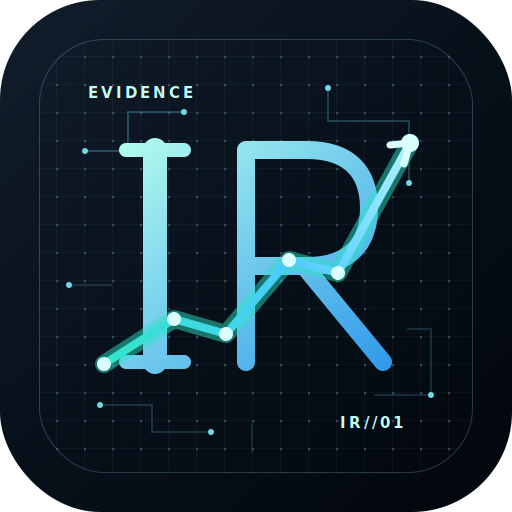

# IR Skill

> 面向 A 股与中国市场研究的 Codex skill：先厘清问题、持有期和证据边界，再给出可追溯、可证伪、带条件的研究判断。

<p align="center">
  
</p>

多数“AI 投研”工具的问题，不是不会算指标，而是把不同的问题塞进同一套筛选器、评分表或报告模板：短线交易被迫做完整基本面，长期研究又被新闻热度带偏；二级数据和抓取内容被误当成财务事实；历史笔记要么完全丢失，要么不加甄别地污染当下判断。

IR Skill 的目标是让 Codex 成为**研究伙伴**，而不是自动荐股器、固定状态机或黑箱打分器。它帮助用户用有限但可靠的证据形成暂时的、可复核的判断，并明确下一步该验证什么。

> 本项目仅用于研究辅助，不构成投资建议、收益承诺或自动交易指令。

## 它解决什么痛点

| 常见痛点 | 造成的问题 | IR Skill 的处理方式 |
| --- | --- | --- |
| 一套固定流程处理所有问题 | “为什么涨了”“短线怎么观察”“值不值得长期跟踪”被强行输出成同一份报告 | 先按意图路由：归因、研究队列、候选比较、持仓复盘、长/中/短期研究各走最小必要路径 |
| AI 把二级数据、网页抓取和推断混在一起 | 看似完整，实则无法判断哪些事实可靠、哪些已过期 | 强制区分事实、推断、假设与未知；关键数字携带来源、报告期、发布时间、获取时间、单位与币种 |
| 长期质量与短期入场混为一个“总分” | 好公司不等于当下适合买入，短线强势也不等于长期值得持有 | 将长期逻辑、当前赔率、技术/交易约束和组合适配分开思考；按持有期使用不同的数据包与研究深度 |
| 自动筛选、因子排名被误当成结论 | 机械分数掩盖数据缺口、估值前提和反方证据 | 脚本只做下载、存储、查询与计算；Agent 负责选择证据、解释传导、比较替代项和形成条件化立场 |
| 历史研究无法复用，或旧观点变成“记忆污染” | 每次从零开始，或把过时结论误当最新事实 | LLM Wiki 完全按需启用；原始资料与综合记忆分层保存，读取时受主题和 `as_of` 约束 |
| 用户的持仓、资料和凭据容易混入公开项目 | 隐私、复现和版本管理都失控 | 研究数据库、原始资料、生成报告、Obsidian 配置和 `.env` 默认本地忽略，不随 skill 代码发布 |

## 与同类工具不同的地方

### 1. 问题驱动，而不是模板驱动

IR Skill 不默认启动全市场筛选、深度报告或长期记忆。它先判断用户是在解释异动、建立候选池、比较标的、评估持仓，还是寻求某个持有期内的行动判断；然后只读取少量直接相关的研究模块。

这意味着：

- 短线技术面问题优先关注价格、成交、流动性、波动、相对强弱、资金与事件风险，不会默认展开长篇基本面研究。
- 长期研究则回到商业质量、竞争、资本配置、治理、估值隐含预期和反方证据，不被短期热度替代。
- 资料不足时可以明确“暂不判断”，而不是为了完整模板而编造结论。

### 2. 为“证据边界”设计，而不是只为“数据更多”设计

公司、交易所和巨潮资讯的定期报告、公告及原始披露是收入、利润、现金流、资产负债表等财务事实的最终依据。TuShare、网页抓取和本地脚本只提供结构化市场数据、披露线索或待核验材料，不能改写原始事实。

输出要求保留：

- 事实与推断的边界；
- 时间边界和 `as_of`；
- 关键反方证据、来源冲突和数据缺口；
- 会改变判断的价格条件、证伪条件与下一验证日期。

### 3. 按投资模式切换信息密度

“长期、中期、短期”不只是报告标题，而是不同的问题集合。Skill 会把持有期与数据需求对齐：长期侧重商业与估值前提，中期增加催化、预期差和行业验证，短期聚焦可交易性、节奏、事件窗口和风险约束。

这避免了两种常见误用：用短期图形替代长期研究，或用冗长的长期分析掩盖一个本质上需要交易约束的问题。

### 4. 把确定性工具和判断权分开

Python 工具负责可重复的机械工作：同步市场数据、调用显式 TuShare endpoint、缓存原始响应、导出数据包、检查 Wiki 链接与结构。它们**不**生成候选排名、长期评级、买卖信号或自动报告。

研究路径、可比对象、证据权重、情景推演和最终表述仍由 Agent 结合上下文完成。这让工作流既可复现，也不会把研究方法锁死在一套难以迭代的状态机中。

### 5. 记忆是可选能力，不是隐性副作用

本项目把持久化分为两层：

- `raw/`：可选的原始资料归档，按主题和日期保存，不可变。
- `wiki/`：可选的 LLM 综合记忆，用于跨轮跟踪假设、结论和待验证事项。

普通研究、技术筛选、短线判断和单次资料下载不会自动读取或写入 Wiki。只有用户明确要求复用、建立、更新、沉淀或复盘研究时，Skill 才启用它。

## 工作流一览

```text
用户问题 + 持有期 + 约束
            │
            ▼
      意图路由与最小研究路径
            │
            ├── 原始披露、公告、官方来源
            ├── 按需的市场/估值/流动性/事件数据
            └── 相关 reference 与模板
            │
            ▼
事实 / 推断 / 假设 / 未知项分层
            │
            ▼
条件化研究立场、反方证据与下一验证动作
            │
            └── 仅在用户要求时写入本地 LLM Wiki
```

## 适合的任务

- 研究一只股票的长期逻辑、当前价格和最重要的反方证据。
- 从特定行业、主题、约束或已有候选中建立研究队列。
- 分析价格异动、业绩变化、政策、行业事件及其可能传导。
- 对候选做比较，对已有持仓做复盘，或制定下一步研究计划。
- 按明确的长、中、短期持有期准备相应的市场、估值、流动性与事件数据。
- 在用户授权下维护本地的研究假设、原始资料和决策复盘。

## 不做什么

- 不自动下单，不输出伪装成确定结论的“强烈买入/卖出信号”。
- 不把因子、技术指标、新闻热度或单一数据源直接转换成长期评级。
- 不用 TuShare 字段、网页抓取或脚本复算替代公司和交易所的财务原始披露。
- 不默认下载全市场、不默认运行筛选，也不默认读取或写入用户的研究记忆。
- 未获得用户明确授权和必要约束时，不将证券层面的研究观点升级为个性化仓位建议。

## 快速开始

### 1. 安装为 Codex skill

```bash
mkdir -p "${CODEX_HOME:-$HOME/.codex}/skills"
git clone https://github.com/LechuanWANG/ir-skill.git \
  "${CODEX_HOME:-$HOME/.codex}/skills/ir-skill"
```

重新启动 Codex 后即可使用 `$ir-skill`。如果已经克隆本仓库，也可以将该目录软链接到 `${CODEX_HOME:-$HOME/.codex}/skills/ir-skill`。

### 2. 用自然语言提出研究问题

```text
Use $ir-skill to compare these three A-share candidates for a 3–5 year research queue.

Use $ir-skill to explain this stock’s price move. Separate confirmed facts,
plausible transmission paths, and what still needs verification.

Use $ir-skill to run a short-term technical screen. Focus on price, liquidity,
momentum, and event risk rather than deep fundamentals.

Use $ir-skill to reassess my holding, archive the new filing, and update only
the relevant pages in my LLM Wiki.
```

### 3. 按需启用数据工具

仅当研究确实需要结构化市场数据时，再安装 Python 依赖、配置 `TUSHARE_TOKEN` 并运行脚本：

```bash
python3 -m pip install pandas tushare
export TUSHARE_TOKEN="your-token"

python3 scripts/tushare_mode_data.py plan medium \
  --symbol 000001.SZ --end-date 20260714

python3 scripts/tushare_mode_data.py fetch short \
  --symbol 000001.SZ --start-date 20260601 --end-date 20260714 --dry-run
```

更一般的 TuShare 请求使用 `scripts/tushare_gateway.py` 显式传入 endpoint 与 JSON 参数。具体的数据选择、权限探测、缓存策略和来源边界见 [`references/tushare-research.md`](references/tushare-research.md) 与 [`references/data-sources.md`](references/data-sources.md)。

## 仓库结构

```text
.
├── SKILL.md                   # Skill 入口、路由与安全边界
├── references/                # 按需读取的研究模块与数据来源规范
├── assets/                    # 可裁剪的备忘录、深度报告和决策记录模板
├── scripts/                   # 仅承担确定性数据与 Wiki 结构工作
└── agents/openai.yaml         # Codex UI 元数据
```

建议从 [`SKILL.md`](SKILL.md) 了解完整路由规则；研究框架与数据边界分别在 [`references/research-screening.md`](references/research-screening.md)、[`references/investment-modes.md`](references/investment-modes.md) 和 [`references/data-sources.md`](references/data-sources.md) 中展开。

## 数据与隐私

- 不要将 `TUSHARE_TOKEN`、`WEBCLAW_API_KEY`、Cookie、代理凭据或其他秘密写入代码、文档、日志或 Wiki。
- `.env`、`data/`、`docs/investment-llm-wiki/`、`output/`、`reports/`、`tmp/` 与 `.obsidian/` 均为本地工作区内容，默认不提交。
- 原始资料归档与 LLM Wiki 都由用户决定是否启用；涉及持仓、资金、偏好或个人风险约束时，写入前需要明确授权。
- 对任何可能影响结论的数据，保留来源、时间点、冲突与不确定性，而不是制造虚假的精确感。

## 免责声明

IR Skill 提供研究方法、证据组织与数据工具，不提供持牌投资顾问服务。市场有风险，使用者应独立判断并自行承担决策责任。
